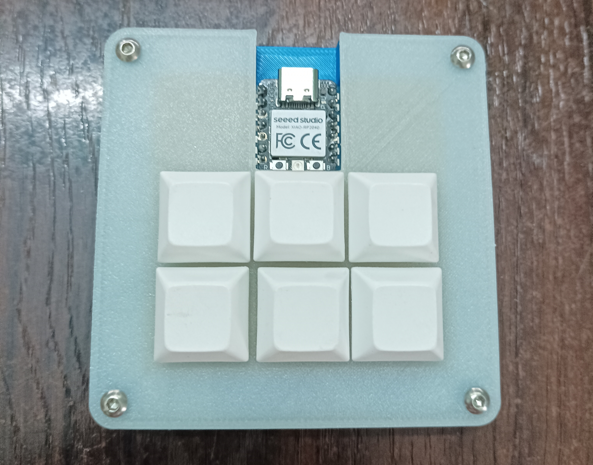
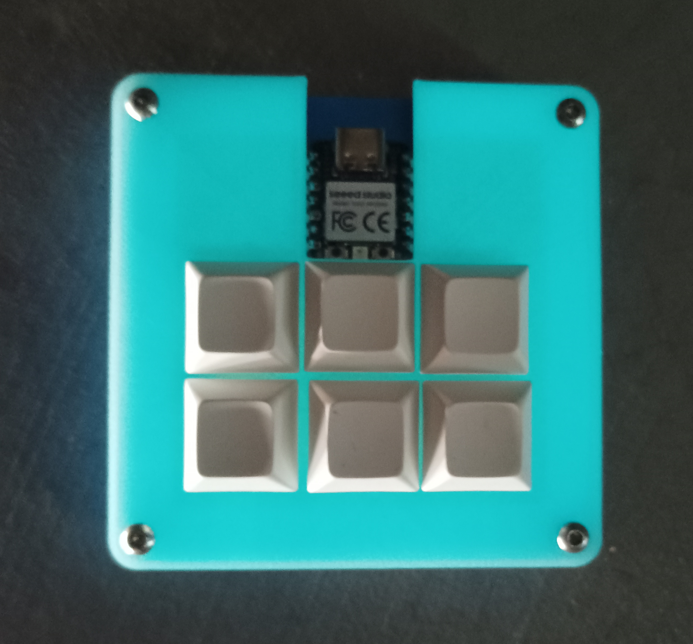
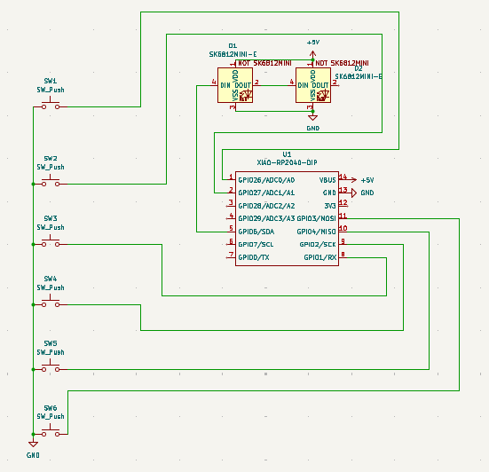
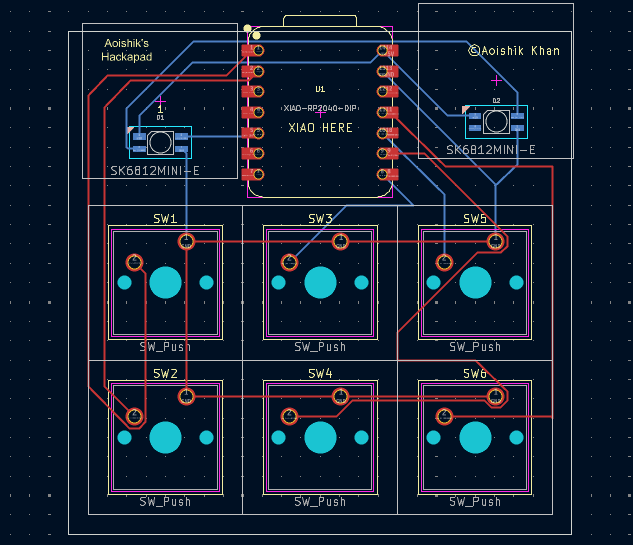
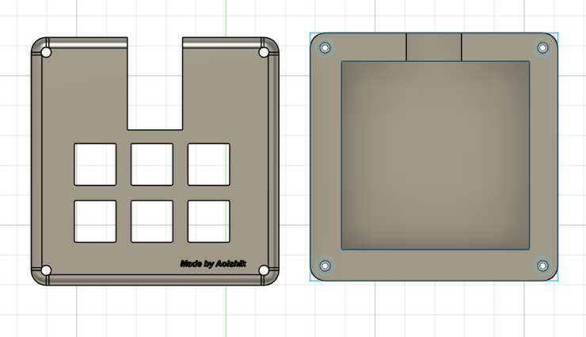
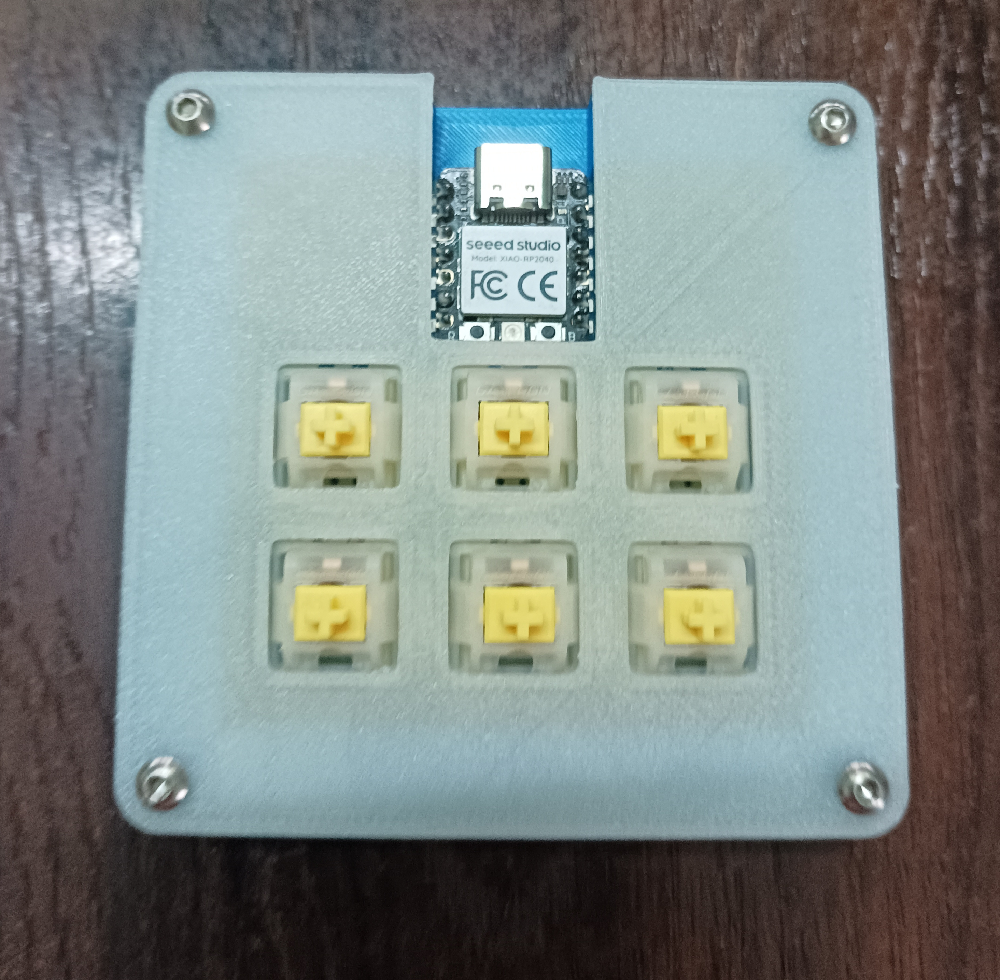

# Aoishik's Hackpad
My first macropad project! Aoishik's Hackpad is a 6-key macropad designed for coding and music control and a sleek 3D-printed case. Demo Link: [Youtube Demo](https://youtu.be/Q0fAI8v2yJ8)

Case at Light  |  Case at No Light (Glow in the Dark)
:-------------------------:|:-------------------------:
  |  

### Inspiration

I wanted to create a macropad that allowed me to code while listening to music simultaneously. I created a macropad using 6 switches and 1 rp2040. 

### Challenges

Believe it or not, this was my first time using Fusion 360 and KiCad! I watched numerous tutorials and guides and did a TON of googling, but in the end, I'm pretty proud of the final product. I had the most struggle figuring out how to make sketches, and with the new mouse controls, it definitely took me a while to get the hang of it. Also in KiCad, I had a lot of trouble with footprints and making sure everything was aligned properly and the traces were correct(but it became a litle long traces).

### Specifications

BOM: 
- 6x Cherry MX Switches
- 1x XIAO RP2040
- 6x Blank DSA Keycaps
- 4x M3x16 Bolt
- 4x M3 Heatset Inserts

Others:
- ZMK Firmware(.uf2 file)
- PCB Gerber File(PCB/PCB.zip)
- Top and Bottom STL files for 3d Printing

Schematic            |  PCB         |   Case
:-------------------------:|:-------------------------:|:-------------------------:|
    |    | 

### Photos

Case (Separated)     |  PCB & Keycaps
:-------------------------:|:-------------------------:
  |  

With Keycaps         |  Without Keycaps (Switches)
:-------------------------:|:-------------------------:
  |  

